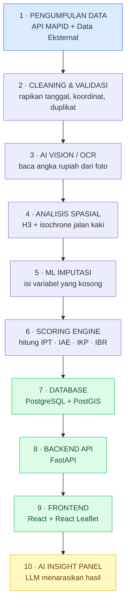
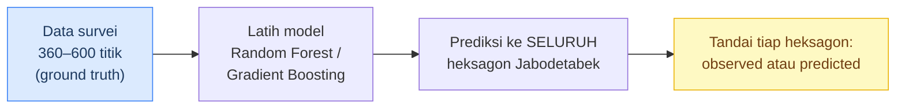
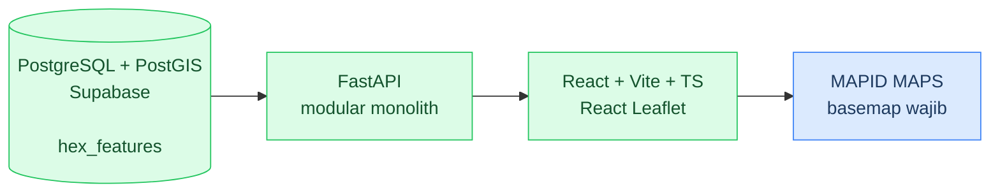
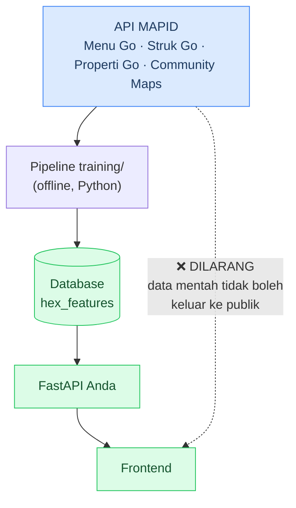

# Alur Sistem Loconomics

> Panduan memahami alur aplikasi dari data mentah sampai rekomendasi di layar pengguna — ditulis dari sudut pandang **WebGIS Developer**.
>
> Konteks: MAPID WebGIS Competition 2026 · Tim Loconomics (Top 50) · Fase eksekusi 7 Agustus – 14 September 2026

---

## 1. Pahami dulu dalam 30 detik

Loconomics menjawab satu pertanyaan sederhana:

> **"Kalau saya mau buka usaha di sekitar stasiun, lokasi mana yang paling bagus — dan kenapa?"**

Selama ini pelaku UMKM menjawabnya pakai mata: *"kayaknya rame nih, ambil aja."* Hasilnya dua kesalahan klasik:

| Kesalahan | Apa yang terjadi |
|---|---|
| **Jebakan Gengsi** | Lokasi terlihat mewah, sewa mahal, tapi perputaran uang riilnya kecil. Rugi. |
| **Hidden Gem terlewat** | Lokasi terlihat biasa saja, tapi permintaannya tinggi dan pesaingnya sedikit. Terlewatkan. |

Loconomics mengubah tebakan visual itu jadi **angka yang bisa dipertanggungjawabkan**.

### Analogi paling gampang

Bayangkan Loconomics sebagai **konsultan bisnis** yang bekerja dalam tiga langkah:

1. **Surveyor** keliling mengumpulkan fakta lapangan → *tahap data*
2. **Analis** mengolah fakta jadi skor 0–100 per lokasi → *tahap scoring*
3. **Konsultan** menjelaskan skor itu dengan bahasa manusia → *tahap AI*

Aplikasi Anda adalah **kantor tempat ketiga orang ini bekerja**, dan **peta adalah meja kerjanya**.

---

## 2. Satuan analisis: kenapa heksagon?

Semua angka di sistem ini menempel pada **heksagon H3 resolusi 9** — bukan pada kelurahan, bukan pada titik.

```
Ukuran 1 heksagon ≈ 0,10 km²  (lebarnya ± 350 meter ≈ satu blok kota)
```

**Kenapa bukan kelurahan?** Terlalu besar (1–3 km²). Satu kelurahan bisa berisi area super ramai dan area sepi sekaligus — dirata-rata, hidden gem-nya hilang.

**Kenapa heksagon, bukan kotak?** Jarak dari pusat ke semua tetangga sama besar. Pada grid kotak, tetangga diagonal lebih jauh daripada tetangga samping — bikin analisis "sekitar sini" jadi bias.

> **Konsekuensi buat Anda:** tabel utama database Anda adalah `hex_features` — **satu baris = satu heksagon**, berisi 41 variabel analisis + 3 penanda kualitas data. Hampir semua endpoint API Anda pada akhirnya membaca tabel ini.

---

## 3. Peta besar alur sistem



**Cara membaca warna:**

- 🔵 **Biru** — sumber data masuk
- ⚪ **Putih** — pipeline pengolahan (dikerjakan Ajis & Ukas, jalan *offline* di folder `training/`)
- 🟢 **Hijau** — **wilayah kerja Anda** (database, backend, frontend)
- 🟡 **Kuning** — lapisan AI yang dilihat pengguna

> **Poin penting yang sering salah dipahami:**
> Tahap 1–6 **tidak berjalan saat pengguna membuka website**. Semuanya diproses lebih dulu (*precompute*), hasilnya disimpan ke database. Saat website dibuka, yang jalan cuma tahap 7–10. Inilah kenapa websitenya bisa cepat.

---

## 4. Tahap demi tahap

### Tahap 1 — Pengumpulan Data

**Dua kelompok sumber:**

**A. Data MAPID** (wajib, diakses lewat **API** karena tim sudah Top 50)

| Dataset | Isinya apa | Yang paling berharga |
|---|---|---|
| **Menu Go** | Profil tempat makan | Harga rata-rata per porsi · Kondisi pembeli (Sepi/Sedang/Ramai) · Keliling atau menetap |
| **Struk Go** | Transaksi riil | Waktu transaksi · **Foto struk** |
| **Properti Go** | Properti dijual/disewa | Kategori properti · **Foto spanduk** |
| **Community Maps** | Aktivitas warga | Titik keramaian non-permanen (pasar kaget, CFD) |

**B. Data eksternal** — OpenStreetMap, Overture Places, WorldPop (populasi), Google Open Buildings (bangunan), NJOP & RDTR dari Jakarta Satu, InaRISK (risiko banjir).

> ⚠️ **Fakta yang menentukan seluruh desain sistem:**
> **Properti Go tidak punya kolom harga. Struk Go tidak punya kolom nominal.**
> Angka rupiahnya cuma ada **di dalam foto**. Inilah alasan AI Vision jadi wajib, bukan pemanis.

---

### Tahap 2 — Cleaning & Validasi

Data lapangan selalu berantakan. Yang harus dibereskan:

- **Tanggal & waktu bertipe teks** dengan format campur: `2026-07-15`, `15/07/2026`, `15 Juli 2026`, `14:30`, `2:30 PM`
- **Koordinat Struk Go bertipe Text**, bukan angka — perlu di-*cast*, kadang pakai koma sebagai desimal
- **Lat/lon tertukar** — kalau `lat > 100`, hampir pasti terbalik
- **Duplikat** — dianggap duplikat hanya jika **ketiganya** terpenuhi: nama mirip ≥85%, jarak ≤30 m, **dan** tanggal survei sama

**Dua aturan yang tidak boleh dilanggar:**

1. **Data dengan tanggal rusak jangan dibuang.** Lokasinya lebih berharga daripada waktunya — set waktu jadi `NULL`, datanya tetap dipakai untuk analisis spasial.
2. **Nilai kosong jangan diisi nol.** *"Nol transaksi tercatat"* ≠ *"tidak ada transaksi di sini"*. Yang pertama artinya belum disurvei, yang kedua artinya memang sepi. Beda makna, beda perlakuan.

---

### Tahap 3 — AI Vision / OCR

Di sinilah foto berubah jadi angka.

| Kode | Tugas AI | Menghasilkan |
|---|---|---|
| **A1** | Baca harga dari **foto spanduk sewa** | `P05` harga sewa median |
| **A2** | Baca nominal dari **foto struk** | `B09` nominal median struk |
| **A3** | Nilai prestise visual dari foto fasad (skala 1–5) | `M03` skor prestise |
| **A4** | Klasifikasi jenis kuliner dari foto menu | `C04` keragaman kuliner |

> 🪤 **Jebakan paling mahal — periode sewa.**
> Spanduk tertulis *"45jt"*. Itu **per bulan** atau **per tahun**? Selisihnya **12 kali lipat**.
> Aturannya: **jangan pernah menebak.** Kalau tidak tertulis, tandai `periode = "tidak_disebut"` dan **keluarkan dari perhitungan median.**

**Aturan operasional lain:**
- Hasil OCR dengan `confidence < 0.7` masuk antrean review manual — jangan langsung dipakai
- Hasil OCR **wajib di-cache ke database**. Jangan pernah memanggil API AI secara live saat demo — kalau internet bermasalah, presentasi Anda mati

---

### Tahap 4 — Analisis Spasial

**Isochrone, bukan lingkaran.** Ini keputusan yang perlu Anda pahami betul.

```
❌ Buffer lingkaran 500 m  →  menganggap semua arah bisa ditembus
✅ Isochrone jalan kaki    →  mengikuti jaringan jalan yang benar-benar ada
```

Titik yang jaraknya cuma 200 m secara garis lurus bisa jadi butuh jalan memutar 900 m karena terhalang rel kereta, sungai, atau tembok. Lingkaran berbohong, isochrone jujur.

Dihitung dengan **OSRM atau Valhalla** (jalan lokal via Docker) untuk tiga tingkat: **5, 10, dan 15 menit jalan kaki** dari tiap simpul transit.

Analisis lain: *zonal statistics* (populasi & bangunan per heksagon), *Shannon entropy* (keragaman jenis usaha), *k-ring 1* (tetangga heksagon, untuk menghitung kompetitor).

> **Wajib diingat:** isochrone dan H3 **di-precompute lalu disimpan ke database**. Backend Anda tidak boleh menghitung ulang jaringan jalan setiap kali peta dibuka.

---

### Tahap 5 — ML Imputasi

**Masalahnya:** survei lapangan cuma menghasilkan ratusan titik. Heksagon di Jabodetabek jumlahnya ratusan ribu.

**Solusinya:** data survei dipakai sebagai **bahan latihan**, bukan sebagai cakupan peta.



Model belajar hubungan seperti:

```
skor_ramai   ~ f(kepadatan POI, populasi, skor simpul transit, tutupan bangunan)
harga_porsi  ~ f(NJOP, pangsa waralaba, luas bangunan, kepadatan kantor)
```

**Validasinya pakai *spatial k-fold*** — data dipisah **per kawasan**, bukan acak. Kalau dipisah acak, model cuma menghafal satu area, bukan belajar polanya.

> ⚠️ **ML di sini hanya untuk mengisi variabel yang kosong.** ML **tidak** menentukan skor akhir. Skor dihitung rumus, bukan diprediksi model — supaya bisa dijelaskan ke juri.

---

### Tahap 6 — Scoring Engine

Semua variabel dinormalisasi ke rentang 0–1, lalu diringkas jadi **4 indeks**:

| Indeks | Artinya | Arah |
|---|---|---|
| **IPT** — Indeks Potensi Transit | Seberapa strategis terhadap simpul transit | ⬆️ makin tinggi makin bagus |
| **IAE** — Indeks Aktivitas Ekonomi | Seberapa besar perputaran uang riil | ⬆️ makin tinggi makin bagus |
| **IKP** — Indeks Kompetisi | Seberapa sesak persaingannya | ⬇️ makin tinggi makin buruk |
| **IBR** — Indeks Biaya & Risiko | Seberapa mahal dan berisiko | ⬇️ makin tinggi makin buruk |

**Rumusnya:**

```
IPT = 0.40·D05 + 0.35·D06 + 0.25·(1 − D04)
IAE = 0.30·D11 + 0.25·D10 + 0.25·B07 + 0.20·B09
IKP = 0.45·C06 + 0.30·C05 + 0.25·(1 − C03)
IBR = 0.35·P01 + 0.30·P05 + 0.25·P06 + 0.10·L03

OPPORTUNITY SCORE = 0.35·IPT + 0.35·IAE − 0.20·IKP − 0.10·IBR
```

**Dibaca dengan bahasa manusia:**

> *Peluang = (potensi transit + aktivitas ekonomi) dikurangi (kompetisi + biaya & risiko).*
> Sisi positif diberi bobot besar (0,35 masing-masing), sisi negatif diberi bobot lebih kecil (0,20 dan 0,10).

**Dan satu gerbang absolut:**

```
× 0   jika L01 (zona izin komersial) = FALSE
```

Kalau RDTR menyatakan area itu tidak boleh untuk usaha komersial, **skornya langsung nol** — berapa pun nilai variabel lain. Ini bukan bobot, ini **saklar**. Gunanya memastikan tidak ada satu pun rekomendasi yang ilegal.

#### Hidden Gem Score

Dihitung terpisah, dan sebuah lokasi baru boleh dilabeli *hidden gem* kalau lolos **lebih dari satu** dari tiga metode ini:

1. **Residual regresi** — biaya diregresikan terhadap potensi. Residual sangat negatif = harganya lebih murah daripada seharusnya.
2. **Kuadran Peluang × Prestise** — peluang tinggi + prestise rendah = *hidden gem*. Kebalikannya (peluang rendah + prestise tinggi) = **Jebakan Gengsi**, ditampilkan sebagai layer peringatan.
3. **IPTT — Indeks Permintaan Tak Terlayani**, metrik paling orisinal tim, murni dari data MAPID:

```
IPTT = norm(rasio_keliling) × norm(skor_ramai) ÷ (1 + norm(n_menetap_kuliner))
```

> Dibaca: *banyak pedagang keliling* × *ramai pembeli* ÷ *sedikit usaha kuliner menetap*.
> Artinya: permintaannya jelas ada, tapi belum ada yang melayani secara permanen. Itulah celah usaha.

---

### Tahap 7–9 — Wilayah Kerja Anda



**Stack yang sudah difinalkan:**

| Lapisan | Teknologi |
|---|---|
| Frontend | React + Vite + TypeScript + React Leaflet + Tailwind |
| Backend | FastAPI (Python), modular monolith |
| Database | PostgreSQL + PostGIS via Supabase |
| ORM & tooling | SQLAlchemy · GeoAlchemy2 · Alembic · Pydantic |
| Deploy | Cloudflare Pages · Render · Supabase |

**Tabel inti:** `transport_nodes`, `catchment_areas`, **`h3_cells`**, `business_pois`, `menu_observations`, `receipt_observations`, `property_observations`, `location_scores`, `score_factors` — semuanya dengan **spatial index GiST**.

**Modul backend:** transit · lokasi usaha · kompetitor · properti · skor · rekomendasi · AI Insight.

**Warna UI tim:** 🟢 `#22C55E` · 🔵 `#3B82F6` · 🟡 `#EAB308`

**Batas MVP — yang sengaja TIDAK dipakai:**
Next.js · microservices · GeoServer · vector tiles · analisis real-time · Docker · login & profil pengguna.
GeoJSON masih cukup. MapLibre baru dipertimbangkan kalau Leaflet mulai berat.

---

## 5. Bagaimana API MAPID masuk ke alur

Ini inti tugas Anda. Perhatikan **API MAPID tidak menyentuh frontend sama sekali**:



**Tiga hal yang harus Anda pegang:**

1. **API MAPID dikonsumsi di tahap ingest (offline), bukan saat pengguna membuka peta.** Data ditarik, diolah, disimpan. Frontend hanya bicara ke FastAPI Anda.
2. **Data mentah MAPID haram keluar.** API publik Anda hanya boleh mengirim **hasil agregasi per heksagon** — tidak boleh ada endpoint atau tabel UI yang menampilkan baris survei individual.
3. **Kunci API disimpan di environment variable**, tidak pernah ditulis di source code. Ini berlaku juga untuk API key MAPID MAPS.

> 📌 **Yang masih harus dicari:** dokumentasi API MAPID belum ada di materi tim mana pun. Kemungkinan besar ada di folder Drive **TOP 50** → subfolder **Technical Meeting** atau **Coaching AI**.

---

## 6. Bagaimana AI masuk ke alur

AI muncul di **dua tempat berbeda** dengan peran yang sangat berbeda. Ini paling sering tertukar:

| | **AI Lapis 1 — di Pipeline** | **AI Lapis 2 — di Interface** |
|---|---|---|
| **Kapan jalan** | Offline, sebelum website dibuka | Live, saat pengguna klik |
| **Tugasnya** | Mengubah foto jadi angka (OCR/Vision) | Menjelaskan angka jadi kalimat |
| **Contoh** | Baca "Rp 45.000.000" dari spanduk | *"Lokasi ini skornya 86 karena…"* |
| **Kalau mati?** | Data tidak lengkap | Pengguna tidak dapat penjelasan |
| **PIC** | Ukas (AI Engineer) | **Anda + Ukas** |

Panitia **mewajibkan Lapis 2** — AI harus bisa diakses langsung dari dalam interface WebGIS. Bentuknya bebas, **tidak harus chatbot**.

### Fungsi yang harus Anda sediakan untuk LLM

LLM bekerja dengan **function calling** ke backend Anda:

| Fungsi | Kegunaannya |
|---|---|
| `cari_lokasi(jenis_usaha, budget, radius_transit, tipologi)` | Cari lokasi sesuai kriteria pengguna |
| `bandingkan(hex_a, hex_b)` | Bandingkan dua lokasi |
| `jelaskan_skor(hex_id)` | Ambil rincian variabel pembentuk skor |
| `flyTo(lat, lon, zoom)` | Gerakkan kamera peta |
| `highlight(hex_ids)` | Sorot heksagon di peta |
| `setLayer(nama_layer)` | Ganti layer aktif |
| `filter(kriteria)` | Terapkan filter |

Perhatikan tiga fungsi terakhir: LLM **mengendalikan peta**. Saat pengguna bertanya *"lokasi bagus buat coffee shop di dekat Stasiun Sudirman?"*, LLM memanggil `cari_lokasi()` lalu `flyTo()` dan `highlight()` — petanya bergerak sendiri. Inilah yang membuat AI terasa menyatu, bukan tempelan.

---

## 7. Dua aturan emas

### 🥇 Aturan 1 — LLM tidak boleh menghitung angka apa pun

LLM **hanya** memanggil fungsi, membaca hasilnya, lalu menceritakannya.

```
✅ BENAR
   LLM → jelaskan_skor("hex_8a2a...") → DB balas: skor 86, IPT 0.82, kompetitor 3
       → LLM menulis: "Skor 86 karena akses transit sangat baik..."

❌ SALAH
   LLM diminta menghitung sendiri → mengarang angka → juri kehilangan kepercayaan
```

**Terapkan di batas API:** satu-satunya sumber angka bagi LLM adalah hasil *tool call*. Jangan pernah menyuapkan data mentah ke prompt lalu minta LLM menyimpulkan sendiri.

### 🥇 Aturan 2 — Setiap skor wajib membawa badge kepercayaan

Sebagian besar heksagon nilainya **hasil prediksi ML**, bukan observasi lapangan. Menyembunyikan fakta ini tidak jujur.

| Kode | Field | Isi |
|---|---|---|
| `Q01` | `n_titik_misi` | Jumlah titik survei di heksagon itu |
| `Q02` | `tingkat_keyakinan` | **TINGGI** ≥30 titik · **SEDANG** 10–29 · **RENDAH** <10 |
| `Q03` | `data_source` | `observed` atau `predicted` |

> Setiap response API yang memuat skor **wajib** menyertakan ketiganya, dan UI wajib menampilkannya. Ini bukan opsi.

---

## 8. Checklist wajib panitia

Yang ada di kendali Anda sebagai WebGIS Dev:

- [ ] **MAPID MAPS sebagai basemap utama** — API key lewat environment variable
- [ ] Peta interaktif jadi **elemen utama** halaman
- [ ] Peta mendukung: **zoom · klik objek · filter · tabel lokasi · tabel atribut · layer control**
- [ ] **AI hadir di dalam interface**, bukan cuma di pipeline
- [ ] Minimal tiga bagian: **Peta Interaktif + Insight + AI Interface**
- [ ] Bisa diakses **publik** saat final
- [ ] **Responsif** di desktop dan mobile
- [ ] Waktu **loading wajar**
- [ ] Output berupa **insight & rekomendasi**, bukan sekadar titik di peta
- [ ] **Data mentah MAPID tidak bocor** lewat API publik mana pun
- [ ] Halaman **Metodologi & Sumber Data** — mencantumkan atribusi ODbL (OSM), CC BY (WorldPop, Open Buildings), CDLA (Overture)

**Larangan yang bisa menggugurkan:**

> ❌ WebGIS yang hanya menampilkan data tanpa analisis atau insight
> ❌ Menyebarluaskan data mentah MAPID atau partner
> ❌ Menggunakan fitur berbayar yang tidak bisa diakses publik

---

## 9. Yang masih menggantung

Poin-poin yang perlu diselesaikan atau ditanyakan:

| # | Isu | Catatan |
|---|---|---|
| 1 | **PRD masih kosong** | Dokumen PRD Loconomics belum berisi apa pun. Padahal PRD inilah yang mendefinisikan flow yang harus Anda pahami. PIC: Wily & Irvan. |
| 2 | **Dokumentasi API MAPID belum ketemu** | Tidak ada di materi tim. Cek Drive TOP 50 → *Technical Meeting* / *Coaching AI*. |
| 3 | **Nama proyek belum seragam** | Dokumen stack Anda dan laporan Ajis masih menulis **STATIONOMICS**; proposal resmi menulis **Loconomics**. |
| 4 | **Proposal bab 5 masih template** | *Kelayakan Teknis* — arsitektur sistem, basis data, deployment, rencana kerja. Itu bagian Anda. |

---

## Ringkasan satu layar

```
DATA        API MAPID (Menu Go · Struk Go · Properti Go · Community Maps)
            + OSM · WorldPop · Open Buildings · NJOP · RDTR · InaRISK
                ↓
OLAH        cleaning → OCR foto jadi rupiah → H3 + isochrone → ML isi yang kosong
                ↓
SKOR        Opportunity = 0.35·IPT + 0.35·IAE − 0.20·IKP − 0.10·IBR
                          × 0 kalau zona tidak mengizinkan usaha
                ↓
SIMPAN      PostGIS · tabel hex_features · 41 variabel + 3 badge kepercayaan
                ↓
SAJIKAN     FastAPI → React Leaflet di atas basemap MAPID MAPS
                ↓
JELASKAN    LLM memanggil fungsi, membaca angka dari DB, menarasikannya
            — LLM tidak pernah menghitung sendiri
```

**Tiga kalimat yang kalau Anda hafal, Anda sudah paham sistemnya:**

1. Semua angka menempel pada **heksagon H3 res-9**, dan `hex_features` adalah tabel pusatnya.
2. Tahap berat **di-precompute offline**; saat pengguna buka website, backend cuma membaca database.
3. **LLM menarasikan, tidak menghitung** — dan setiap skor selalu ditemani badge kepercayaan.
