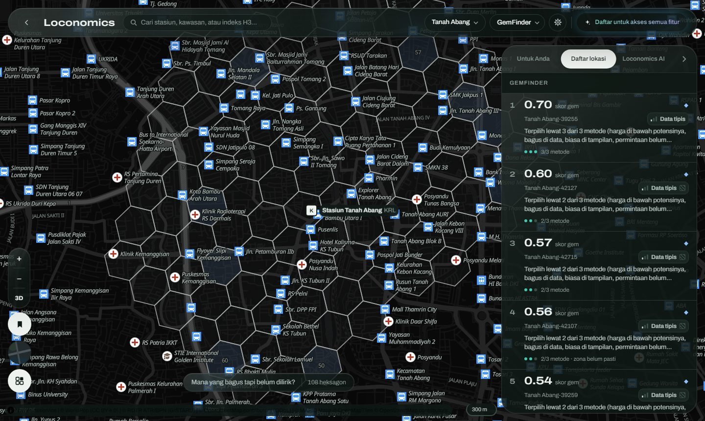
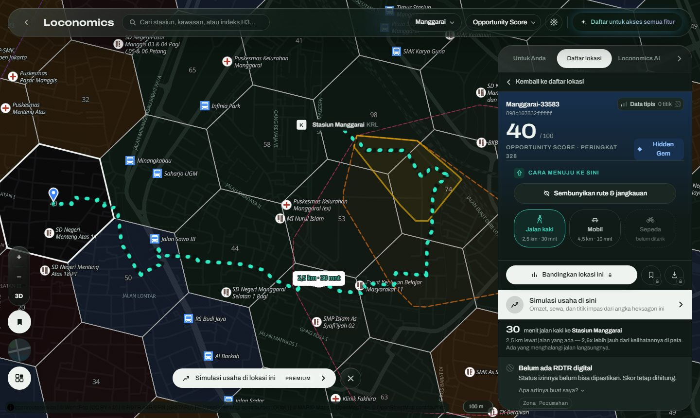
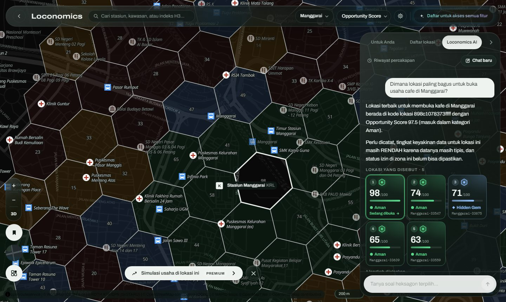

<div align="center">

# Loconomics

**Transit-oriented Retail Recommender**
WebGIS pendukung keputusan untuk memilih lokasi usaha di sekitar simpul transportasi massal Jabodetabek

MAPID WebGIS Competition #2 2026 · *Maps That Think! — Mass Transportation Edition*
Tim Loconomics · Universitas Telkom

**[Buka WebGIS](https://loconomics.pages.dev)** · **[Dokumen PRD](docs/PRD.md)** · [Cermin GitHub Pages](https://fijarsatria.github.io/loconomics/)

</div>



---

## Masalah

Calon pelaku UMKM memilih lokasi usaha dengan mata. Yang terlihat ramai dianggap bagus, yang terlihat sepi dianggap buruk. Dari situ lahir dua kesalahan:

- **Hidden Gem terlewat**: lokasi yang terlihat biasa saja, padahal datanya bagus dan sewanya jauh lebih murah.
- **Jebakan Gengsi**: lokasi yang terlihat mahal dan bergengsi, padahal ekonominya tidak mendukung. Kesalahan inilah yang paling sering menghabiskan modal pemula.

## Solusi

Loconomics membagi enam kawasan pilot di sekitar simpul KRL, MRT, dan LRT menjadi **708 heksagon H3** (±350 m). Setiap heksagon dinilai mesin skor yang dapat diaudit:

| Keluaran | Isi |
|---|---|
| **Opportunity Score** 0–100 | Gabungan empat indeks: potensi transit, aktivitas ekonomi, kompetisi, serta biaya & risiko |
| **Kuadran** | Hidden Gem · Aman · Jebakan Gengsi · Hindari, dari skor dibandingkan prestise visual |
| **ZoneGuard** | Zona RDTR yang melarang usaha membuat skornya **nol mutlak** |
| **RiskRadar** | Peringatan pergantian usaha (churn) |
| **Lencana keyakinan** | Seberapa tebal data survei di balik skor itu |

Hasilnya tampil di peta berbasemap **MAPID Maps** dan dijelaskan oleh **Loconomics AI**, konsultan yang menjawab dalam bahasa sehari-hari dan menggerakkan petanya sendiri.

## Fitur utama

| | |
|---|---|
|  |  |
| **Detail heksagon & rute.** Skor, kuadran, zonasi, dan rute jaringan jalan (jalan kaki dan mobil) ke stasiun terdekat, lengkap dengan kawasan jangkau 5–60 menit | **Loconomics AI.** Memanggil 13 alat, membaca angka dari basis data, lalu terbang dan menyorot lokasi di peta. Setiap jawaban membawa jejak alat yang dipanggil |

- **Lima layer tematik**: Opportunity Score, PriceLens, GemFinder (Hidden Gem), RiskRadar, ZoneGuard. Tersedia lima gaya basemap MAPID, termasuk satelit dan gedung 3D.
- **Bedah 7 blok**: satu heksagon dipecah menjadi tujuh blok ±130 m untuk memilih sisi jalan yang tepat, dan setiap blok bisa disimulasikan.
- **Simulasi usaha**: omzet, laba, dan titik impas untuk 16 jenis usaha, dengan asumsi yang dinyatakan terbuka.
- **Komparasi 2–4 lokasi** dan **Laporan Kelayakan PDF**.
- **Rekomendasi personal** menurut jenis usaha, kawasan, dan anggaran sewa.
- **Lokasi tersimpan & titik favorit**: tandai titik persis di dalam heksagon dan beri nama.
- **Metodologi & sumber data** di dalam aplikasi: sumber resmi vs perkiraan, peran survei lapangan, batasan, dan rekomendasi untuk pemangku kepentingan.
- Dua bahasa (Indonesia/Inggris), tema gelap/terang, dan responsif di desktop maupun ponsel.

**IPTT (Indeks Permintaan Tak Terlayani)** adalah metrik orisinal tim: *banyak pedagang keliling × pembeli ramai ÷ sedikit usaha menetap*. Metrik ini hanya bisa dihitung karena misi **Menu Go** MAPID mencatat mobilitas pedagang dan kondisi pembeli.

## Data

| Sumber | Dipakai untuk |
|---|---|
| **MAPID Community Maps & Mission** (Menu Go, Struk Go, Properti Go) | Harga per porsi, keramaian pembeli, pedagang keliling, nominal & jam transaksi (OCR foto struk), pasokan ruang sewa, lencana keyakinan |
| **MAPID Maps** | Basemap seluruh peta |
| OpenStreetMap | 3.444 POI usaha dalam 8 kelas, simpul transit, bangunan, jaringan jalan |
| openrouteservice | Rute jalan kaki & mobil 708/708 heksagon, isochrone |
| WorldPop 2020 | Penduduk dan usia produktif |
| RDTR ATR/BPN (GISTARU) | Izin komersial, kelas zona, risiko banjir |
| Model tim AI ([syahh-coder/Loconomics-AI](https://github.com/syahh-coder/Loconomics-AI), GradientBoosting) | Perkiraan harga per porsi & keramaian — dilatih dari campuran survei MAPID dan data sintetis, tampil di panel detail dengan label tersendiri |

Data mentah MAPID **tidak pernah** keluar dari API. Yang ditampilkan hanya rangkuman per heksagon, dan rangkuman dari satu baris survei pun ditahan. Rincian komposisi data pelatihan model tim AI dan cara membacanya ada di [docs/metadata.md](docs/metadata.md).

## Arsitektur

```
pipeline/  Python s1 → s7        ingest MAPID API · OSM · WorldPop · RDTR · ORS
    │                            OCR Gemini Vision · skor (satu-satunya tempat skor dihitung)
    ▼
PostgreSQL + PostGIS (Supabase)
    │
    ▼
backend/   FastAPI (Azure)       7 modul API · akun & langganan · Loconomics AI (Gemini, function calling)
    │
    ▼
frontend/  React + MapLibre GL   peta · insight · AI dalam satu layar (Cloudflare Pages & GitHub Pages)
```

| Lapisan | Teknologi |
|---|---|
| Frontend | React 19, TypeScript, Vite, MapLibre GL, Tailwind CSS, GSAP |
| Backend | Python, FastAPI, SQLAlchemy, GeoAlchemy2, Pydantic, ReportLab |
| Basis data | PostgreSQL + PostGIS (Supabase), Alembic |
| Pipeline | Pandas, GeoPandas, Shapely, h3, OSMnx, scikit-learn, rasterio |
| AI | Google Gemini (vision di pipeline, function calling di produk), GradientBoosting |

## Struktur repositori

```
backend/    API FastAPI, migrasi Alembic, dan uji (tests/)
frontend/   Aplikasi WebGIS React + MapLibre
pipeline/   Pengolahan data s1–s7, prompt AI (prompts/), dan uji
docs/       PRD dan dokumentasi teknis
```

| Dokumen | Isi |
|---|---|
| [docs/PRD.md](docs/PRD.md) | **Product Requirements Document**: masalah, tujuan, fitur, data & AI, alur, kepatuhan ketentuan |
| [docs/arsitektur.md](docs/arsitektur.md) | Backend, frontend, basis data, deployment |
| [docs/data.md](docs/data.md) | Kamus 43 variabel dan sumbernya |
| [docs/skoring.md](docs/skoring.md) | Rumus skor, bobot, Hidden Gem, uji sensitivitas |
| [docs/ai.md](docs/ai.md) | AI di pipeline dan di dalam produk |
| [docs/metadata.md](docs/metadata.md) | Asal-usul setiap angka: diukur atau diperkirakan |

## Menjalankan secara lokal

```bash
# Backend  → http://localhost:8000
cd backend
python -m venv venv && source venv/Scripts/activate
pip install -r requirements.txt
cp .env.example .env          # isi DATABASE_URL, LLM_API_KEY, dll.
alembic upgrade head
python -m uvicorn app.main:app --port 8000

# Frontend → http://localhost:5173
cd frontend
npm install
cp .env.example .env          # isi VITE_API_BASE_URL dan VITE_MAPID_BASEMAP_KEY
npm run dev

# Uji
cd backend  && python tests/test_akun.py && python tests/test_infra.py && python tests/test_ai_loop.py
cd pipeline && python test_s6_score.py
```

## Tim

| Nama | Peran |
|---|---|
| Irvan Tegar Yunadi | Business Analyst |
| Wily Franklyn Togatorop | UI/UX Designer |
| Fijar Satria Pinandita Mangkauna | WebGIS Developer |
| Ukasyah | AI Engineer |
| Azziz Abdul Ghofur | Data Analyst |

<sub>Data Community Maps dan misi MAPID dipakai hanya untuk keperluan kompetisi dan tidak disebarluaskan. Atribusi sumber terbuka: © OpenStreetMap contributors (ODbL), openrouteservice (CC BY-SA 4.0), WorldPop (CC BY 4.0), RDTR ATR/BPN.</sub>
