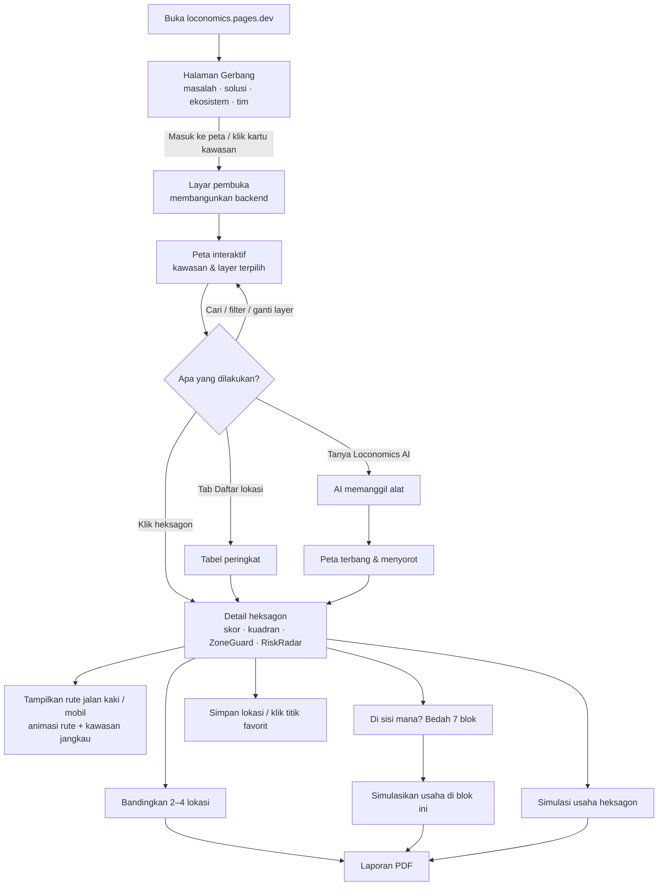
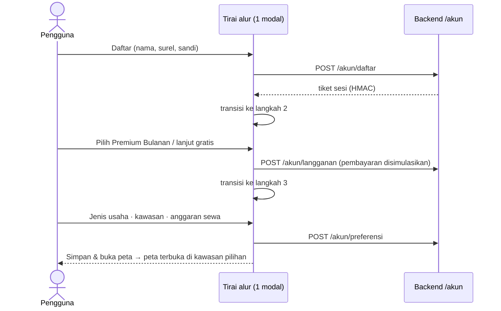
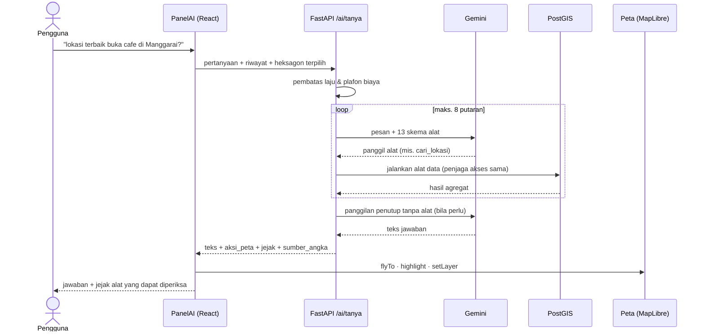

# Product Requirements Document (PRD) — Loconomics

**Transit-oriented Retail Recommender: pemilihan lokasi usaha berbasis data dan AI di sekitar simpul transportasi massal Jabodetabek**

| | |
|---|---|
| **Kompetisi** | MAPID WebGIS Competition #2 2026 — *Maps That Think! — Mass Transportation Edition* |
| **Tim** | Loconomics — Tim #33 dari Top 50, Program Studi Informatika, Universitas Telkom |
| **Versi dokumen** | 1.0 (final) — 13 September 2026 |
| **Status produk** | Rilis final, dapat diakses publik |
| **WebGIS (utama)** | https://loconomics.pages.dev |
| **WebGIS (cermin)** | https://fijarsatria.github.io/loconomics/ |
| **API** | https://loconomics-api.azurewebsites.net (dokumentasi interaktif: `/docs`) |
| **Kode sumber** | https://github.com/Fijarsatria/loconomics |

### Tim dan peran

| Nama | Peran | Fokus kontribusi |
|---|---|---|
| Irvan Tegar Yunadi | Business Analyst | Alur pengguna, narasi masalah, kebutuhan dan manfaat bisnis |
| Wily Franklyn Togatorop | UI/UX Designer | Pengalaman pengguna, wireframe, mockup, responsivitas, visualisasi informasi |
| Fijar Satria Pinandita Mangkauna | WebGIS Developer | Arsitektur frontend/backend, peta interaktif, API, basis data, deployment |
| Ukasyah | AI Engineer | OCR/vision, model prediksi variabel, AI Insight, evaluasi dan validasi model |
| Azziz Abdul Ghofur | Data Analyst | Inventarisasi data, data cleaning, feature engineering, analisis spasial, scoring |

### Daftar isi

1. [Ringkasan produk](#1-ringkasan-produk)
2. [Definisi masalah dan kebutuhan pengguna](#2-definisi-masalah-dan-kebutuhan-pengguna)
3. [Tujuan produk, manfaat, dan ruang lingkup](#3-tujuan-produk-manfaat-dan-ruang-lingkup)
4. [Spesifikasi fitur dan kebutuhan produk](#4-spesifikasi-fitur-dan-kebutuhan-produk)
5. [Data, analisis spasial, dan integrasi AI](#5-data-analisis-spasial-dan-integrasi-ai)
6. [Alur pengguna dan rancangan sistem](#6-alur-pengguna-dan-rancangan-sistem)
7. [Kepatuhan terhadap ketentuan panitia](#7-kepatuhan-terhadap-ketentuan-panitia)
8. [Konsistensi dengan produk final, batasan, dan pengembangan](#8-konsistensi-dengan-produk-final-batasan-dan-pengembangan)
9. [Lampiran](#9-lampiran)

---

## 1. Ringkasan produk

**Loconomics** adalah WebGIS *Decision Support System* yang membantu calon pelaku UMKM memilih lokasi usaha di sekitar simpul transportasi massal. Loconomics memberi tahu dua hal yang tidak bisa dilihat dengan mata:

- **Hidden Gem**: lokasi yang *terlihat* biasa, tetapi datanya bagus. Permintaannya nyata, kompetisinya wajar, dan biayanya di bawah yang seharusnya.
- **Jebakan Gengsi**: lokasi yang *terlihat* mahal dan bergengsi, tetapi ekonominya tidak mendukung. Kuadran ini yang paling sering menghabiskan modal pemula.

Wilayah Jabodetabek dipecah menjadi **708 heksagon H3 resolusi 9** (±350 m) di **6 kawasan pilot** yang mewakili empat moda: KRL, MRT, LRT, dan terminal. Setiap heksagon dinilai oleh mesin skor yang dapat diaudit, dengan hasil berikut:

| Keluaran per heksagon | Isi |
|---|---|
| Opportunity Score | Skor 0–100 |
| Kuadran | Salah satu dari empat: Hidden Gem, Pemenang Jelas, Jebakan Gengsi, Hindari |
| Status zonasi (ZoneGuard) | Diizinkan, dilarang, atau belum ada RDTR |
| Sinyal risiko (RiskRadar) | Peringatan churn usaha |
| Lencana keyakinan | Menunjukkan seberapa tebal datanya |

Seluruh hasil ditampilkan di **peta interaktif berbasemap MAPID Maps**. Hasil yang sama diterjemahkan oleh **Loconomics AI**, konsultan berbasis *function calling* yang:

- menjawab dalam bahasa sehari-hari;
- mengambil setiap angka dari basis data, bukan mengarangnya;
- **menggerakkan peta**: terbang ke lokasi, menyorot heksagon, dan mengganti layer.

> **Satu kalimat untuk juri:** Loconomics tidak hanya merekomendasikan lokasi. Ia juga *melindungi* pemula dari lokasi yang tampak menjanjikan tetapi datanya tidak mendukung.

---

## 2. Definisi masalah dan kebutuhan pengguna

### 2.1 Masalah inti

Pelaku UMKM di kawasan transit memilih lokasi **dengan mata**. Yang terlihat ramai dianggap bagus, yang terlihat sepi dianggap buruk. Dari kebiasaan itu lahir dua kesalahan, yang sebenarnya satu masalah dilihat dari dua arah: **tampilan dan data tidak selalu sejalan**.

| # | Masalah (*pain point*) | Bukti atau akar penyebab | Jawaban Loconomics |
|---|---|---|---|
| P1 | **Tidak ada angka finansial nyata.** Harga sewa dan belanja konsumen tidak tercatat di basis data mana pun | Kolom data misi Properti Go dan Struk Go **tidak memuat satu pun angka rupiah**; angkanya hanya ada di foto spanduk dan foto struk | Pipeline AI vision membaca foto struk dan spanduk menjadi angka terstruktur (§5.4) |
| P2 | **Jebakan Gengsi.** Sewa premium di lokasi bergengsi yang perputaran ekonominya rendah | Keputusan diambil dari tampilan fisik bangunan | Kuadran *Opportunity Score × Prestise Visual* dengan peringatan churn di RiskRadar |
| P3 | **Hidden Gem terlewat** | Lokasi berpenampilan biasa tidak pernah dilirik | Tiga metode Hidden Gem: residual biaya, kuadran, dan IPTT (§5.3) |
| P4 | **Risiko legalitas.** Membuka usaha di zona yang tidak mengizinkan | Data RDTR tersebar dan sulit dibaca awam | ZoneGuard: zona yang melarang usaha membuat skornya **nol mutlak** |
| P5 | **Jarak ke stasiun menipu** | Rute jalan kaki sungguhan rata-rata **1,78× lebih panjang** daripada garis lurus (diukur atas 703 rute) | Rute jaringan jalan openrouteservice untuk jalan kaki dan mobil, plus kawasan jangkau 5–60 menit |
| P6 | **Data geospasial sulit diterjemahkan** | UMKM tidak punya analis GIS | Konsultan AI yang menjelaskan dan menggerakkan peta |
| P7 | **Satu heksagon terlalu besar untuk memilih sisi jalan** | Heksagon ±350 m memuat jalan besar *dan* gang di belakangnya | Bedah blok: heksagon dipecah menjadi 7 blok res-10 (±130 m), masing-masing bisa disimulasikan |

### 2.2 Pengguna sasaran (persona)

| Persona | Pertanyaan utama | Kebutuhan | Fitur yang paling menolong |
|---|---|---|---|
| **Calon pemilik UMKM** (mis. calon pemilik kafe kecil, modal terbatas) | "Di mana sebaiknya saya buka, dengan sewa di bawah Rp10 juta?" | Rekomendasi yang jelas, bahasa awam, peringatan risiko | GemFinder, ZoneGuard, AI Consultant, Simulasi usaha |
| **Pemilik usaha yang mau pindah atau ekspansi** | "Apakah lokasi baru ini lebih baik dari yang sekarang?" | Perbandingan berdampingan, riwayat skor | Komparasi 2–4 lokasi, RiskRadar, Laporan PDF |
| **Perencana kota / pengembang TOD / peneliti** | "Kawasan mana yang permintaannya belum terlayani?" | Indikator agregat per kawasan, metodologi yang dapat diaudit | IPTT, dinamika kawasan, halaman Sumber Data |

### 2.3 Kebutuhan pengguna (*user stories*)

| ID | Sebagai… | Saya ingin… | Supaya… | Dijawab oleh |
|---|---|---|---|---|
| US-01 | calon pemilik UMKM | melihat lokasi mana yang berpeluang di sekitar sebuah stasiun | saya tidak memilih berdasarkan tebakan | Layer Opportunity + Daftar lokasi |
| US-02 | calon pemilik UMKM | tahu apakah sebuah lokasi *terlihat bagus padahal tidak* | modal saya tidak habis di Jebakan Gengsi | Kuadran + RiskRadar |
| US-03 | calon pemilik UMKM | tahu apakah zonasi mengizinkan usaha | usaha saya legal | ZoneGuard |
| US-04 | calon pemilik UMKM | bertanya dengan bahasa biasa, mis. "dimana lokasi terbaik buka cafe di Manggarai?" | saya tidak perlu mengerti GIS | Loconomics AI |
| US-05 | calon pemilik UMKM | melihat berapa menit jalan kaki atau berkendara ke stasiun | saya bisa menilai akses pembeli komuter | Rute jalan kaki & mobil, kawasan jangkau |
| US-06 | calon pemilik UMKM | tahu sisi mana di dalam heksagon yang paling baik | saya memilih ruko di sisi jalan yang tepat | Bedah 7 blok |
| US-07 | calon pemilik UMKM | menghitung apakah usaha saya bisa balik modal | saya tahu berapa pembeli per hari yang dibutuhkan | Simulasi usaha (per heksagon & per blok) |
| US-08 | pemilik usaha | membandingkan beberapa kandidat lokasi | saya memilih yang terbaik secara objektif | Komparasi 2–4 lokasi |
| US-09 | pemilik usaha | menyimpan lokasi incaran dan menandai titik persisnya | saya bisa memantau dan kembali ke sana | Lokasi tersimpan + titik favorit |
| US-10 | pemilik usaha | membawa hasil analisis ke pemilik modal atau bank | keputusan saya punya dasar tertulis | Laporan Kelayakan PDF |
| US-11 | perencana / juri | tahu dari mana setiap angka berasal dan apa batasannya | analisisnya bisa dipercaya | Halaman Sumber Data, lencana keyakinan, `jejak` AI |
| US-12 | pengguna ponsel | memakai peta dengan nyaman di layar kecil | saya bisa memeriksa lokasi saat berada di lapangan | Tata letak responsif (lembar bawah) |

---

## 3. Tujuan produk, manfaat, dan ruang lingkup

### 3.1 Tujuan produk

| ID | Tujuan | Indikator keberhasilan (terukur di produk final) |
|---|---|---|
| G1 | Mengubah data mentah multi-sumber menjadi **rekomendasi lokasi** yang dapat ditindaklanjuti | 708/708 heksagon berskor dan berkuadran; daftar rekomendasi per kawasan dan per preferensi pengguna |
| G2 | **Melindungi** pemula dari lokasi berisiko | Kuadran Jebakan Gengsi ditampilkan terang-terangan; zona terlarang **selalu** berskor 0 (dijaga uji otomatis) |
| G3 | Menghadirkan AI yang **menyatu dengan peta**, bukan tempelan | Setiap jawaban membawa `jejak` alat dan aksi peta yang benar-benar dieksekusi; pertanyaan "lokasi terbaik buka cafe di Manggarai" dijawab ±10 detik di produksi |
| G4 | **Jujur tentang mutu data** | Setiap skor membawa lencana keyakinan; nilai kosong tampil "belum terukur", bukan nol; halaman Sumber Data memisahkan data resmi dan perkiraan |
| G5 | Dapat diakses publik di desktop dan ponsel | Terbit di Cloudflare Pages + GitHub Pages; backend Azure App Service; tata letak khusus ponsel |

### 3.2 Manfaat per pemangku kepentingan

| Pemangku kepentingan | Manfaat |
|---|---|
| **Calon pelaku UMKM** | Menekan risiko gagal di tahun pertama karena salah lokasi; mendapat akses *location intelligence* yang biasanya hanya dimiliki ritel besar |
| **Pemilik properti & pengembang TOD** | Mengetahui heksagon dengan permintaan belum terlayani (IPTT) untuk menentukan jenis tenant |
| **Pemerintah daerah / perencana kota** | Gambaran ekonomi mikro sekitar simpul transit; kepatuhan zonasi yang terlihat di peta |
| **Operator transportasi** | Memahami aktivitas ekonomi dalam jangkauan jalan kaki stasiun sebagai dasar pengembangan kawasan stasiun |
| **Masyarakat / SDG** | Mendukung SDG 8 (pekerjaan layak & pertumbuhan ekonomi) dan SDG 11 (kota berkelanjutan) |

### 3.3 Ruang lingkup

**Termasuk (in scope):**

| Aspek | Cakupan |
|---|---|
| Wilayah | 6 kawasan pilot: Manggarai (KRL), Tanah Abang (KRL), Depok Baru (KRL), Bekasi (KRL), Dukuh Atas BNI (MRT), Harjamukti (LRT) |
| Unit analisis | 708 heksagon H3 res-9, dan 4.956 blok res-10 untuk bedah di dalam heksagon |
| Fitur analisis | Peta tematik 5 layer, detail heksagon, rute & kawasan jangkau, bedah blok, simulasi usaha, komparasi, rekomendasi personal, pemantauan, laporan PDF |
| AI | Pembacaan foto (OCR) di pipeline; model perkiraan variabel; Konsultan AI dengan 13 alat di dalam antarmuka |
| Akun | Tamu, gratis, dan premium. Pembayaran **disimulasikan** (tanpa transaksi uang), sehingga seluruh fitur tetap dapat diakses publik |
| Bahasa & tema | Indonesia/Inggris; tema gelap/terang |

Dua kawasan pilot sengaja dipilih ekstrem sebagai uji kewarasan model. Dukuh Atas BNI (CBD, prestise tertinggi) menguji deteksi Jebakan Gengsi, dan Harjamukti (moda terbaru, kawasan belum matang) menguji deteksi Hidden Gem.

**Tidak termasuk (out of scope), disengaja:**

- **Bukan marketplace properti.** Tidak ada listing dan tidak ada transaksi sewa.
- **Bukan prediksi omzet pasti.** Simulasi usaha menampilkan skenario dan titik impas dengan asumsi yang dinyatakan terbuka.
- **Tidak melebar ke luar 6 kawasan pilot** pada siklus lomba ini.
- **Tidak menampilkan data misi MAPID mentah.** Yang keluar hanya agregat per heksagon (ketentuan A.1 & B.7).
- Tidak memakai Google Places API, scraping situs listing, atau sumber tile selain MAPID Maps.

---

## 4. Spesifikasi fitur dan kebutuhan produk

### 4.1 Peta fitur

Enam fitur bernama membentuk inti produk. Fitur-fitur di bawahnya menopang alur keputusan pengguna.

| ID | Fitur | Apa yang dilakukan | Variabel / sumber utama | Kriteria penerimaan | Akses |
|---|---|---|---|---|---|
| F-01 | **Peta Interaktif** | Peta MapLibre GL berbasemap MAPID Maps (5 gaya termasuk satelit, mode 3D gedung) dengan grid heksagon berwarna | MAPID Maps, `/hex/layer` | Zoom, geser, putar, klik heksagon, dan pilih gaya berjalan; heksagon tergambar di build produksi | Semua |
| F-02 | **Layer tematik (layer control)** | Lima layer: Opportunity Score, PriceLens, Hidden Gem, RiskRadar, ZoneGuard, beserta legenda dan Kompas Kuadran | `location_scores`, `hex_features` | Mengganti layer mewarnai ulang heksagon; legenda dan cakupan layer ikut berganti | Semua |
| F-03 | **Pencarian & filter** | Cari stasiun, kawasan, atau indeks H3; saring kawasan (multi-kawasan untuk premium); saring kuadran lewat Kompas Kuadran; skor minimum & kuadran lewat AI | `/meta/kawasan`, `/transit/nodes` | Hasil pencarian menerbangkan peta; filter mengurangi heksagon yang tampil | Semua (multi-kawasan: premium) |
| F-04 | **Daftar lokasi (tabel lokasi)** | Tabel peringkat heksagon menurut layer aktif, dengan skor, kuadran, dan lencana | `/skor/ranking`, `/skor/hidden-gems`, `/skor/risk-radar` | Mengklik baris membuka detail dan menerbangkan peta | Semua |
| F-05 | **Detail heksagon (tabel atribut)** | Skor, kuadran & penjelasannya, lencana keyakinan, empat indeks, faktor pembentuk skor, 43 variabel, perkiraan model | `/hex/{h3}` | Tamu dan akun gratis menerima skor, kuadran, ZoneGuard, dan RiskRadar; nilai granular **ditahan di server**, bukan diblur | Ringkas: semua. Granular: premium |
| F-06 | **GemFinder** | Menandai Hidden Gem beserta metode yang dilewati dan buktinya | Residual biaya, kuadran, IPTT | Minimal 10 teratas per kawasan; tiap baris menyebut alasan | Semua |
| F-07 | **RiskRadar** | Peringatan Jebakan Gengsi dan churn usaha | Opportunity × Prestise, P06 churn | Peringatan hanya muncul bila churn > persentil 75 kawasan **dan** melewati lantai absolut | Semua |
| F-08 | **ZoneGuard** | Status izin RDTR per heksagon; zona terlarang berskor 0 | RDTR ATR/BPN (GISTARU), L01–L03 | Heksagon terlarang selalu 0 dan tidak pernah direkomendasikan; zona tanpa RDTR tertulis "belum bisa dipastikan" | Semua |
| F-09 | **PriceLens** | Sewa per m², sewa bulanan, belanja per jam, rentang wajar kawasan | P05, P07, B07, B10 | Layer harga di peta gratis; kartu harga per heksagon premium | Layer: semua. Kartu: premium |
| F-10 | **Commuter Clock** | Pola uang berpindah jam 05:00–22:00, memisahkan penumpang *captive* dan *choice* | `hex_hourly_profiles`, B01–B04 | 18 titik jam; pangsa captive selalu ditandai estimasi | Ember 4-slot: semua. Per jam: premium |
| F-11 | **Rute & kawasan jangkau** | Rute jaringan jalan ke simpul terdekat untuk **jalan kaki dan mobil** (plus alternatif), dan isochrone 5/10/15/30/60 menit | openrouteservice (`hex_routes`, `catchment_areas`) | 708/708 heksagon punya rute jalan kaki dan mobil; kamera membingkai rute lalu garis **tumbuh beranimasi** dari heksagon ke stasiun | Semua |
| F-12 | **Bedah 7 blok** ("Di sisi mana, di dalam heksagon ini") | Heksagon dibedah jadi 7 blok res-10. Menampilkan peta mini, blok terbaik/terlemah, fakta (menit ke stasiun, jarak jalan utama, halte, keramaian, usaha sekitar) dalam meteran 5 titik, dan zona per blok | `blok_heksagon`, OSM, ORS, RDTR | Warna mengikuti skor, bukan peringkat; zona terlarang berskor 0; bahasa awam tanpa persentase | Semua |
| F-13 | **Simulasi usaha** | Omzet, laba, pembeli impas, pangsa impas, dan tabel kepekaan untuk 16 jenis usaha; sewa & harga boleh diisi sendiri | `core/simulasi.py`, B10, P05 | Asumsi tampil terbuka; bisa per heksagon atau **per blok** (faktor permintaan 0,6–1,4 yang dinyatakan sebagai asumsi) | Premium |
| F-14 | **Komparasi** | Baki 2–4 lokasi berdampingan, bar per metrik, lencana bernomor di peta, ekspor PDF | `/skor/komparasi` | Nomor kolom sama dengan lencana di peta | Premium |
| F-15 | **Rekomendasi personal ("Untuk Anda")** | Lokasi sesuai jenis usaha, kawasan incaran, dan anggaran sewa dari onboarding, dengan alasan per baris | `/skor/rekomendasi` | Urutan tetap mengikuti `opportunity_score` pipeline; akun gratis melihat 3 teratas | Gratis: 3. Premium: semua |
| F-16 | **Lokasi tersimpan & titik favorit** | Simpan heksagon; klik sekali di dalam heksagon terbuka untuk menandai titik persis; beri nama; pin penanda buku dengan nama saat disorot; klik pin membuka detail; hapus dari panel atau daftar | `watchlist_items` (lat, lon, nama) | Titik harus di dalam heksagon (validasi `ST_Contains`); hapus berhasil dari kedua tempat | Simpan/beri nama: premium. Hapus: semua akun |
| F-17 | **Pemantauan & dinamika kawasan** | Selisih skor sejak disimpan, sebaran churn, komposisi kuadran kawasan | `/skor/dinamika`, `/skor/riwayat/{h3}` | Selisih dihitung terhadap skor yang dibekukan saat disimpan | Premium |
| F-18 | **Laporan Kelayakan PDF** | Laporan satu lokasi, komparasi, dan simulasi (termasuk asumsi blok) | ReportLab di backend | Dijaga pembatas beban; hanya untuk premium | Premium |
| F-19 | **Loconomics AI** | Konsultan percakapan yang memanggil 13 alat dan menggerakkan peta (§5.5) | `/ai/tanya` | Jawaban membawa `jejak`, `sumber_angka`, dan aksi peta; tidak ada angka karangan | Semua (alat berbayar mengikuti hak akses pengguna) |
| F-20 | **Halaman Gerbang (Beranda/Overview)** | Scrollytelling: hero, masalah, 6 keputusan (potret peta sungguhan), ekosistem produk, penutup, tim | `ringkasan-data.ts` | Tidak bergulir mendatar di 390 px; CTA membuka peta di kawasan/layer yang dipilih | Semua |
| F-21 | **Sumber Data & Metodologi** | Sumber RESMI vs PERKIRAAN, lisensi, cakupan per sumber, batasan, dan 4 temuan terukur | Dibangkitkan `s7_publish.py --ekspor` | Tidak ada angka yang diketik tangan | Semua |
| F-22 | **Akun & alur langganan** | Daftar → pilih paket (Premium Bulanan Rp25.000, pembayaran disimulasikan) atau lanjut gratis → preferensi usaha → peta terbuka di kawasan pilihan, dalam satu tirai bertransisi | `/akun/*` | "Simpan & buka peta" benar-benar membuka peta | Semua |
| F-23 | **Dua bahasa & dua tema** | Indonesia/Inggris, gelap/terang, pilihan milik pembaca | `lib/bahasa.tsx` | Kalimat tanpa pasangan terjemahan gagal di tahap kompilasi | Semua |

### 4.2 Kebutuhan fungsional

| ID | Kebutuhan | Prioritas |
|---|---|---|
| FR-01 | Sistem menampilkan peta interaktif sebagai elemen utama, dengan basemap MAPID Maps | Wajib |
| FR-02 | Pengguna dapat zoom, klik objek, memfilter data, melihat tabel lokasi, melihat tabel atribut, dan mengganti layer | Wajib |
| FR-03 | Setiap heksagon memiliki Opportunity Score 0–100, kuadran, status ZoneGuard, dan lencana keyakinan | Wajib |
| FR-04 | Skor hanya dihitung di pipeline (`s6_score.py`); backend membaca, frontend menampilkan, LLM tidak menghitung | Wajib |
| FR-05 | Zona RDTR yang melarang usaha membuat Opportunity Score = 0 dan tidak pernah direkomendasikan | Wajib |
| FR-06 | AI dapat diakses dari dalam antarmuka, menjawab berdasarkan data, dan mengeksekusi aksi peta (`flyTo`, `highlight`, `setLayer`, `filter`) | Wajib |
| FR-07 | Setiap jawaban AI menyertakan jejak alat dan sumber angka | Wajib |
| FR-08 | Nilai yang tidak diukur tampil sebagai "belum terukur" dan digambar abu-abu, tidak pernah nol | Wajib |
| FR-09 | Konten berbayar tidak pernah dikirim dalam respons API kepada tamu atau akun gratis | Wajib |
| FR-10 | Data misi MAPID mentah tidak pernah keluar dari API; hanya agregat per heksagon | Wajib |
| FR-11 | Pengguna dapat melihat rute jalan kaki dan mobil beserta menit tempuh ke simpul terdekat | Tinggi |
| FR-12 | Pengguna dapat membedah heksagon menjadi 7 blok dan mensimulasikan usaha per blok | Tinggi |
| FR-13 | Pengguna dapat membandingkan 2–4 lokasi dan mengunduh laporan PDF | Tinggi |
| FR-14 | Pengguna dapat menyimpan, menamai, dan menghapus lokasi serta menandai titik favorit | Sedang |
| FR-15 | Pengguna dapat mendaftar, memilih paket, dan mengisi preferensi usaha yang menyetel rekomendasi dan simulasi | Sedang |

### 4.3 Kebutuhan non-fungsional

| ID | Kategori | Kebutuhan | Cara pemenuhan |
|---|---|---|---|
| NFR-01 | **Performa** | Waktu muat wajar pada koneksi umum | Pemuatan malas (`React.lazy`) untuk peta, gerbang, simulasi, dan dialog; bundel awal ±427 KB; GZip & kompresi geometri; cache TTL 10 menit di backend |
| NFR-02 | **Ketersediaan** | Peta tetap tampil walau backend lambat atau tidak menjawab | GeoJSON statis di CDN sebagai cadangan grid heksagon; berkas gaya basemap statis |
| NFR-03 | **Responsivitas** | Nyaman di desktop, tablet, dan ponsel | Panel samping di layar lebar; lembar bawah di ponsel; bantalan kamera asimetris supaya heksagon tidak tertutup panel |
| NFR-04 | **Keamanan** | Kunci API tidak bocor; akses berbayar tidak bisa dibobol | Kunci LLM, MAPID Data, dan ORS hanya di environment backend; sandi scrypt; tiket sesi HMAC; penjaga akses sebagai dependensi FastAPI; CORS daftar putih; argumen `pengguna` dari model dibuang |
| NFR-05 | **Keandalan galat** | Galat tidak membocorkan detail internal | Amplop galat seragam (kode generik + `request_id`); detail hanya di log server |
| NFR-06 | **Kendali biaya AI** | AI tidak bisa dikuras | Pembatas laju 10 permintaan/60 detik per alamat; plafon biaya harian dari `ai_call_logs`; beberapa kunci Gemini sebagai cadangan otomatis |
| NFR-07 | **Aksesibilitas** | Dapat dipakai beragam pengguna | `prefers-reduced-motion` dihormati; label ARIA; kontras teks dijaga; dua bahasa |
| NFR-08 | **Auditabilitas** | Setiap angka dapat ditelusuri | Lencana keyakinan Q01–Q03; `score_factors`; `jejak` AI; halaman Sumber Data; prompt AI sebagai berkas |
| NFR-09 | **Kualitas kode** | Regresi tertangkap sebelum rilis | 5 berkas uji backend (±450 asersi), 4 uji pipeline, `tsc` + `oxlint`, audit Playwright build produksi |

---

## 5. Data, analisis spasial, dan integrasi AI

### 5.1 Sumber data

**Data dasar panitia (wajib, dipakai):**

| Kelompok | Dataset | Cara ambil | Dipakai untuk |
|---|---|---|---|
| Community Maps (Activity) | Aktivitas pengguna MAPID APPS | MAPID Data API, disaring per poligon wilayah studi | D12 aktivitas komunitas (menyentuh 91 heksagon) |
| Data Mission | **Menu Go**: harga per porsi, kondisi pembeli, mobilitas pedagang | MAPID Data API | B07 harga, D10 keramaian terkoreksi, C07 rasio pedagang keliling, C08 usaha kuliner menetap → **IPTT** |
| Data Mission | **Struk Go**: foto struk, kategori tempat | MAPID Data API + OCR foto | B09 nominal, B01–B04 jam transaksi, Commuter Clock |
| Data Mission | **Properti Go**: kategori, sewa/jual, foto spanduk & fasad | MAPID Data API + OCR foto | P03 pasokan ruang, P05 harga sewa, M03 prestise visual |
| Survey Activities | Survei lapangan tim lewat MAPID APPS | Masuk ke dataset misi dan ditarik bersama data misi lainnya | Validasi dan pengayaan heksagon yang disurvei; lencana keyakinan |
| MAPID Maps | Basemap vektor (4 gaya) + satelit | `basemap.mapid.io` | Basemap utama seluruh peta |

Data misi ditarik **per poligon**, bukan per tim: yang masuk adalah survei seluruh peserta yang jatuh di enam kawasan pilot. Dari **2.873 titik misi** yang ditarik, **47 observasi** jatuh di dalam 708 heksagon dan menyentuh **26 heksagon**.

**Data sekunder (resmi, terbuka, sumber dicantumkan):**

| Sumber | Lisensi | Mengisi | Cakupan |
|---|---|---|---|
| OpenStreetMap (Overpass) | ODbL 1.0 | C01–C06 kompetisi (3.444 POI usaha, 8 kelas induk), D05 simpul, D08–D09, M01–M02 bangunan, jaringan jalan untuk blok | 708 heksagon |
| openrouteservice | CC BY-SA 4.0 | D03 jarak & D04 waktu jalan kaki, rute mobil, isochrone, matriks menit per blok | 708 heksagon (jalan kaki & mobil) |
| WorldPop 2020 (UN-adjusted, constrained) | CC BY 4.0 | D01 penduduk, D02 usia produktif, C06 kompetitor per kapita | 707–708 heksagon |
| RDTR ATR/BPN (GISTARU) | Data terbuka pemerintah | L01 izin komersial, L02 kelas zona, L03 risiko banjir | 364 heksagon (DKI Jakarta; Depok & Bekasi belum punya RDTR digital) |

Sumber yang **sengaja tidak dipakai**: Google Places API, scraping Rumah123/OLX, dan GTFS komunitas yang tidak resmi.

### 5.2 Pengolahan data (alur B.3 panitia)

| Tahap panitia | Implementasi Loconomics | Berkas |
|---|---|---|
| 1. Identifikasi data awal | Kamus Data Final: **43 variabel** dalam 6 dimensi (Permintaan, Perilaku Konsumen, Kompetisi, Biaya & Ruang, Risiko & Legalitas, Morfologi & Prestise) | `docs/data.md`, `pipeline/config.py` |
| 2. Cleaning & standardisasi | Enam aturan pembersihan: koordinat di luar wilayah dibuang, satuan % disimpan 0–100, taksonomi usaha 8 kelas (satu POI tepat satu kelas), sekolah/masjid/kantor bukan kompetitor, NaN tidak pernah jadi nol | `s2_*`, `s7_publish.py` |
| 3. Pengayaan & validasi | Survey activities MAPID APPS; rencana survei 30 heksagon diturunkan dari basis data; pembanding lapangan untuk menguji model | `rencana_survei.py` |
| 4. Data tidak terstruktur | Foto struk dan spanduk dibaca Gemini Vision menjadi JSON tervalidasi | `s3_extract.py`, `pipeline/prompts/*.md` |
| 5. Penggunaan AI | OCR (A1–A4), perkiraan variabel (GradientBoosting), Konsultan AI | §5.4–5.5 |
| 6. Analisis spasial | Spatial join H3, network analysis ORS, isochrone, overlay zonasi berbobot luas, scoring & indexing, regresi residual, kuadran | §5.3 |
| 7. Output spasial & insight | `location_scores`, `score_factors`, `blok_heksagon`, `hex_routes`, `catchment_areas`, 4 temuan terukur | `s6_score.py` |
| 8. Integrasi WebGIS | FastAPI → React/MapLibre, AI function calling ke peta | `backend/`, `frontend/` |

### 5.3 Analisis spasial

1. **Grid H3 res-9.** Seluruh variabel diagregasi ke heksagon ±0,10 km² supaya sumber berbeda skala (titik survei, poligon zonasi, raster penduduk, jaringan jalan) bisa dibandingkan dalam satu satuan.
2. **Spatial join & agregasi.** Titik POI OSM dan titik misi MAPID diagregasi per heksagon. Raster WorldPop dijumlahkan per poligon heksagon.
3. **Network analysis.** Rute jaringan jalan openrouteservice dari pusat heksagon ke simpul terdekat, untuk jalan kaki dan mobil (maksimal 3 alternatif). Temuan: rute jalan kaki rata-rata **1,78×** garis lurus, dan 161 heksagon harus berjalan dua kali lipat atau lebih.
4. **Isochrone (kawasan jangkau).** Pita 5/10/15 menit dari ORS, dan 30/60 menit. Temuan: Stasiun Manggarai justru punya jangkauan 15 menit **tersempit** (0,96 km²), 3,1× lebih kecil daripada MRT Dukuh Atas BNI, karena emplasemen rel memotong jalan kaki.
5. **Overlay zonasi berbobot luas.** RDTR disampel per *poligon* heksagon dan ditimbang menurut luas perpotongan, bukan satu titik tengah. Hasilnya 278 heksagon diizinkan, 13 dilarang, dan 417 belum ber-RDTR.
6. **Scoring & indexing.** Normalisasi min-max per kawasan (log1p untuk variabel berekor panjang), lalu empat indeks komposit:

   | Indeks | Arah | Komponen (bobot) |
   |---|---|---|
   | IPT — Potensi Transit | tinggi = baik | D05 skor simpul 0,40 · D06 ridership 0,35 · D04 waktu jalan (dibalik) 0,25 |
   | IAE — Aktivitas Ekonomi | tinggi = baik | D11 intensitas transaksi 0,30 · D10 keramaian 0,25 · B07 harga porsi 0,25 · B09 nominal struk 0,20 |
   | IKP — Kompetisi | tinggi = buruk | C06 kompetitor per kapita 0,45 · C05 pangsa waralaba 0,30 · C03 keragaman (dibalik) 0,25 |
   | IBR — Biaya & Risiko | tinggi = buruk | P01 NJOP 0,35 · P05 sewa 0,30 · P06 churn 0,25 · L03 banjir 0,10 |

   ```
   mentah  = 0,35·IPT + 0,35·IAE − 0,20·IKP − 0,10·IBR
   skor    = norm(mentah) × 100
   skor    = 0  bila zona_izin_komersial = FALSE        (ZoneGuard: gate, bukan bobot)
   ```

   Variabel kosong dinetralkan ke **0,5** (tengah skala) saat perhitungan, bukan 0. Nilai 0 berarti "terburuk yang pernah diamati".
7. **Hidden Gem, tiga metode (lolos minimal 2 dari 3):**
   - *Residual biaya*: regresi OLS `IBR ~ IPT + IAE + populasi`; residual di bawah kuartil 1 berarti lebih murah dari yang seharusnya.
   - *Kuadran*: Opportunity tinggi × Prestise Visual rendah (batas median).
   - *IPTT (Indeks Permintaan Tak Terlayani)*, metrik orisinal tim yang hanya bisa dihitung dengan data Menu Go:

     ```
     IPTT = norm(rasio pedagang keliling) × norm(keramaian pembeli) / (1 + norm(usaha kuliner menetap))
     ```
8. **Kuadran Prestise × Peluang.** Hasil saat ini: Hidden Gem 105, Pemenang Jelas 249, Jebakan Gengsi 105, Hindari 249.
9. **Skor blok res-10.** Tujuh blok per heksagon dari 6 indikator (menit ke simpul 0,30; jarak jalan utama 0,20; penarik keramaian 250 m 0,15; usaha 150 m 0,15; halte 0,10; tutupan bangunan 0,10), dikurangi banjir dan pesaing sekelas. Normalisasinya **global** atas 4.956 blok, supaya blok yang mirip tetap berskor mirip.
10. **Uji sensitivitas bobot.** Setiap bobot digeser ±0,10. Korelasi Spearman peringkat terhadap baseline ρ = **0,97–0,99** (target > 0,85), artinya peringkat ditentukan data, bukan pilihan bobot.

### 5.4 AI di dalam pipeline (Lapisan A)

| Kode | Peran AI | Input | Output | Validasi |
|---|---|---|---|---|
| A1 | Ekstraksi harga sewa | Foto spanduk Properti Go | P05 harga sewa (JSON) | Skema Pydantic; `confidence < 0,7` masuk antrean tinjau; rentang wajar |
| A2 | Ekstraksi nominal & jam transaksi | Foto struk Struk Go | B09 nominal, B01–B04 jam | Idem; 330 dari 462 struk terbaca; cache per SHA-1 URL |
| A3 | Penilaian prestise visual | Foto fasad | M03 prestise (dinilai **tanpa** data ekonomi supaya sumbu kuadran independen) | Korelasi terhadap NJOP diuji (target r 0,5–0,7) |
| A4 | Ekstraksi harga & kelas menu | Foto menu Menu Go | B07, B08, C04 | Idem |
| A6 | **Perkiraan variabel** (GradientBoostingRegressor, bukan LLM) | 14 fitur: centroid, populasi, bangunan, banjir, jarak simpul, kompetitor, generator keramaian | PERKIRAAN D10 & B07 di tabel `hex_perkiraan`, panel detail saja | Diuji ulang terhadap pengamatan lapangan: MAE B07 Rp14.580 (MAPE 41%), D10 2,34 pada skala 1–3. Angka selisih ini **ditampilkan** di layar bersama perkiraannya |

Prompt A1–A4 disimpan sebagai berkas di `pipeline/prompts/`, sehingga perubahannya tercatat di git dan menjadi bukti ketentuan C.1. Setiap panggilan model tercatat di `ai_call_logs`.

**Temuan jujur:** spanduk "DIKONTRAKAN" hampir tidak pernah memuat harga (18 dari 19 hanya memuat nomor telepon). Model membaca dengan benar; angkanya memang tidak ada di lapangan.

### 5.5 AI di dalam antarmuka (Lapisan B): Loconomics AI

**Posisi.** Panel "Loconomics AI" berdampingan dengan peta dan panel insight dalam satu layar. AI → peta → heksagon → panel insight membentuk satu rantai interaksi.

**Arsitektur.** Loop agentik ditulis tangan di `backend/app/api/ai.py`, dengan penyedia Google Gemini (model `gemini-3-flash-preview`, cadangan otomatis antarmodel dan antarkunci API).

| Kelompok | Alat | Fungsi |
|---|---|---|
| Dieksekusi **backend** (membaca basis data) | `cari_lokasi` | Cari heksagon menurut jenis usaha, anggaran sewa, menit jalan, kawasan |
| | `jelaskan_skor` | Rincian faktor pembentuk skor |
| | `bandingkan` | Dua lokasi berdampingan beserta zonasi & risikonya |
| | `cek_harga` | Kartu PriceLens (mengikuti hak akses pengguna) |
| | `pola_jam` | Commuter Clock (mengikuti hak akses pengguna) |
| | `cek_zona` | Status RDTR |
| | `bedah_blok` | Tujuh blok di dalam heksagon untuk kelas usaha tertentu |
| | `cari_hidden_gem` | Hidden Gem + alasan |
| | `cek_risiko` | Jebakan Gengsi berperingatan churn |
| Dieksekusi **frontend** (menggerakkan peta) | `flyTo` | Terbang ke koordinat |
| | `highlight` | Sorot heksagon |
| | `setLayer` | Ganti layer tematik |
| | `filter` | Terapkan saringan skor/kuadran |

**Input → proses → output → validasi (ketentuan C.1):**

| | |
|---|---|
| **Input** | Pertanyaan pengguna, riwayat percakapan (maks. 20 pesan, disimpan di peramban), konteks heksagon terpilih |
| **Proses** | Model memilih alat dari daftar tertutup (skema *strict*); backend mengeksekusi alat data dan mengembalikan hasilnya; alat peta dikumpulkan sebagai `aksi_peta`; maksimal 8 putaran, lalu satu panggilan penutup **tanpa alat** memaksa jawaban disusun dari hasil yang sudah terkumpul |
| **Output** | `teks` (bahasa pertanyaan), `aksi_peta` (dieksekusi di peta), `jejak` (setiap alat + argumennya), `sumber_angka` (faktor skor yang dikutip), `keyakinan` (lencana heksagon), `hex_disebut` |
| **Validasi** | (1) **LLM tidak menghitung**: setiap angka berasal dari alat. (2) Jawaban tanpa satu pun panggilan alat ditandai `perlu_review` di `ai_call_logs`. (3) Penjaga akses berbayar yang sama dengan endpoint; argumen `pengguna` dari model selalu dibuang. (4) Heksagon kosong-data tidak dibuang dari pencarian, dan model diberi tahu nilainya belum diketahui. (5) 50 asersi uji loop dengan klien tiruan, termasuk batas putaran dan panggilan penutup |

**Contoh nyata (produksi, 13 Sep 2026).** Pertanyaan *"dimana lokasi paling bagus untuk buka usaha cafe di manggarai?"* dijawab dalam ±10 detik:

- Alat yang dipanggil berurutan: `cari_lokasi` → `jelaskan_skor` → `cek_harga` → `pola_jam` → `flyTo` → `highlight` → `setLayer`.
- Isi jawaban: satu heksagon berskor 80,6 di Zona Transportasi yang mengizinkan usaha, risiko churn rendah, dan catatan bahwa keyakinan datanya masih RENDAH.

### 5.6 Mutu data dan kejujuran

| Mekanisme | Isi |
|---|---|
| **Lencana keyakinan Q01–Q03** | Jumlah titik survei, tingkat keyakinan (RENDAH/SEDANG/TINGGI), dan asal data (`observed` / `predicted`). Saat ini 26 heksagon `observed`, 682 `predicted`, seluruhnya berkeyakinan RENDAH (maks. 4 titik survei per heksagon; ambang SEDANG = 10) |
| **Tiga golongan angka** | *Diukur* (kolom `hex_features`), *Perkiraan model* (tabel `hex_perkiraan`, tidak pernah masuk skor atau peta), *Tidak ada* (NULL, digambar abu-abu) |
| **Estimasi pengisi untuk demonstrasi** | Pada rilis final, sel variabel yang belum punya sumber lapangan (antara lain P01 NJOP, P05 sewa, P06 churn, dan profil jam) **diisi estimasi** oleh `pipeline/demo_pameran.py` supaya seluruh layer, termasuk PriceLens dan RiskRadar, dapat diperagakan. Rinciannya: (1) estimasi diturunkan dari sinyal nyata heksagon itu sendiri (jarak simpul, penduduk WorldPop, POI OSM) dengan pola yang dapat direproduksi, bukan diacak; (2) skornya tetap dihitung mesin yang sama; (3) lencana keyakinan **tidak dinaikkan**, jadi panel tetap menyatakan "belum disurvei langsung"; (4) seluruh sel yang disentuh tercatat di manifes dan dapat dicabut persis dengan `python demo_pameran.py --copot` |

---

## 6. Alur pengguna dan rancangan sistem

### 6.1 Struktur antarmuka

```
┌──────────────────────────────────────────────────────────────────────┐
│ Bilah atas: ← Loconomics │ Cari stasiun/kawasan/H3 │ Kawasan ▾ │ Layer ▾ │ Tema │ Akun │
├───────┬──────────────────────────────────────────────┬───────────────┤
│ Rel   │                                              │ Panel kanan   │
│ kiri: │        PETA INTERAKTIF (MapLibre)            │ ┌───────────┐ │
│ + / − │   heksagon berwarna layer aktif,             │ │Untuk Anda │ │
│ 3D    │   rute & kawasan jangkau, 7 blok,            │ │Daftar     │ │
│ Simpan│   pin lokasi tersimpan, lencana komparasi    │ │lokasi     │ │
│ Basem.│                                              │ │Loconomics │ │
│ Kompas│                                              │ │AI         │ │
│       │  [pil pertanyaan layer / ajakan simulasi]    │ └───────────┘ │
└───────┴──────────────────────────────────────────────┴───────────────┘
Ponsel: panel kanan menjadi lembar bawah; kamera memberi bantalan di bawah.
```

### 6.2 Alur utama pengguna



### 6.3 Alur akun: daftar → paket → preferensi



### 6.4 Alur AI



### 6.5 Arsitektur sistem

```
      Offline (dijalankan tim)                     Online (dilayani ke pengguna)
┌───────────────────────────────┐
│ pipeline/  Python s1 → s7     │   tulis   ┌────────────────────────────┐
│ ingest MAPID API · OSM ·      │──────────▶│ PostgreSQL + PostGIS       │
│ WorldPop · RDTR · ORS         │           │ (Supabase)                 │
│ OCR Gemini Vision · GBR       │           └─────────────┬──────────────┘
│ s6_score.py (satu-satunya     │                         │ baca saja
│ tempat skor dihitung)         │           ┌─────────────▼──────────────┐     ┌──────────────┐
└───────────────────────────────┘           │ backend/ FastAPI           │◀───▶│ Google Gemini│
                                            │ Azure App Service          │     └──────────────┘
                                            │ 7 router · 46 rute         │
                                            └─────────────┬──────────────┘
                                                          │ JSON / GeoJSON
┌──────────────────┐                        ┌─────────────▼──────────────┐
│ MAPID Maps       │───────── ubin ────────▶│ frontend/ React 19 + Vite  │
│ basemap.mapid.io │                        │ MapLibre GL · Tailwind v4  │
└──────────────────┘                        │ Cloudflare Pages & GH Pages│
                                            └────────────────────────────┘
```

**Tumpukan teknologi**

| Lapisan | Teknologi |
|---|---|
| Frontend | React 19, TypeScript 6, Vite 8, MapLibre GL 6, Tailwind CSS 4, GSAP (halaman gerbang) |
| Backend | Python, FastAPI 0.115, SQLAlchemy 2, GeoAlchemy2, Pydantic 2, ReportLab (PDF) |
| Basis data | PostgreSQL + PostGIS di Supabase, migrasi Alembic |
| Pipeline | Pandas, GeoPandas, Shapely, h3, OSMnx, scikit-learn, rasterio/rasterstats; Overpass, openrouteservice, GISTARU |
| AI | Google Gemini (vision di pipeline; function calling di produk), GradientBoostingRegressor |
| Deploy | Cloudflare Pages + GitHub Pages (frontend), Azure App Service (backend), GitHub Actions (CI/CD) |

### 6.6 Rancangan basis data (ringkas)

| Tabel | Isi |
|---|---|
| `hex_features` | 708 baris: 43 variabel + 3 penanda kualitas + geometri heksagon |
| `location_scores` | Opportunity Score, 4 indeks, Hidden Gem Score, kuadran, per `versi` |
| `score_factors` | 9.912 baris kontribusi (bobot × nilai) untuk penjelasan skor |
| `blok_heksagon` | 4.956 blok res-10 dan skornya |
| `hex_perkiraan` | Perkiraan model yang tidak pernah masuk skor |
| `hex_hourly_profiles` | Profil jam Commuter Clock |
| `hex_routes`, `catchment_areas`, `transport_nodes` | Rute ORS (jalan kaki, mobil), isochrone, 6 simpul |
| `business_pois` | 3.444 POI usaha OSM, 8 kelas induk |
| `menu_observations`, `receipt_observations`, `property_observations` | Observasi misi MAPID (tidak pernah dikirim mentah) |
| `users`, `subscriptions`, `watchlist_items` | Akun, langganan, lokasi tersimpan (lat, lon, nama) |
| `ai_call_logs` | Jejak audit setiap panggilan AI: input, output, biaya, `perlu_review` |

### 6.7 API (ringkas)

| Router | Rute utama |
|---|---|
| `meta` | `/health`, `/meta/siap`, `/meta/kawasan`, `/meta/basemap/{gaya}/style.json` |
| `hex` | `/hex/layer`, `/hex/{h3}`, `/hex/{h3}/blok`, `/hex/{h3}/simpul-terdekat`, `/hex/{h3}/commuter-clock`, `/hex/{h3}/simulasi` |
| `pricelens` | `/pricelens/layer`, `/pricelens/ringkasan`, `/pricelens/{h3}` |
| `transit` | `/transit/nodes`, `/transit/simpul/{id}`, `/transit/catchment` |
| `skor` | `/skor/ranking`, `hidden-gems`, `risk-radar`, `kuadran`, `zoneguard/*`, `komparasi`, `riwayat/{h3}`, `dinamika`, `rekomendasi`, `versi`, `banding-versi` |
| `ai` | `/ai/fungsi`, `/ai/status`, `/ai/tanya` |
| `akun` | `/akun/daftar`, `masuk`, `saya`, `paket`, `langganan`, `preferensi`, `pantauan` (GET/POST/PATCH/DELETE), `laporan/{h3}`, `laporan-komparasi`, `laporan-simulasi/{h3}` |

### 6.8 Rancangan keamanan

| Ancaman | Kendali |
|---|---|
| Kebocoran kunci API | Kunci Gemini, MAPID Data, dan ORS hanya di App Settings Azure / `.env` yang di-gitignore; kunci basemap hanya ditempel ke host `basemap.mapid.io` |
| Pembobolan konten berbayar | Penahanan di server (bukan blur CSS); `wajib_akses_penuh` sebagai dependensi; uji `test_akun.py` memastikan tamu & akun gratis **tidak** menerima isinya |
| Penempaan sesi | Tiket HMAC dengan kunci dari environment; sandi scrypt |
| Injeksi & XSS | ORM + parameter terikat; validasi indeks H3 & nama kawasan dari daftar putih; nama lokasi di pin ditulis lewat `textContent` |
| Penyalahgunaan AI | Pembatas laju, plafon biaya harian, daftar alat tertutup, argumen `pengguna` dari model dibuang |
| Kebocoran detail galat | Amplop galat generik + `request_id` |
| Lintas-asal | CORS daftar putih asal resmi; metode yang diizinkan hanya yang dipakai frontend |

---

## 7. Kepatuhan terhadap ketentuan panitia

### 7.1 Komponen wajib WebGIS (B.2)

| Ketentuan | Status | Di mana |
|---|---|---|
| Peta interaktif sebagai elemen utama | ✅ | Layar utama aplikasi (F-01) |
| Basemap MAPID MAPS | ✅ | 5 gaya dari `basemap.mapid.io` (F-01) |
| Zoom | ✅ | Tombol +/−, gulir, cubit |
| Klik objek | ✅ | Klik heksagon → detail; klik blok; klik pin |
| Filter data | ✅ | Kawasan (multi-kawasan), saringan kuadran lewat Kompas Kuadran; filter skor/kuadran lewat AI |
| Tabel lokasi | ✅ | Tab "Daftar lokasi" (F-04) |
| Tabel informasi atribut | ✅ | Panel detail heksagon (F-05); granular untuk premium, dapat diaktifkan siapa pun tanpa biaya |
| Layer control | ✅ | Pemilih layer + legenda + pemilih basemap + 2D/3D (F-02) |
| Visualisasi data | ✅ | Layer tematik, grafik jam, bar harga, Kompas Kuadran, peta mini blok, bar komparasi |
| AI di dalam interface | ✅ | Panel Loconomics AI (F-19) |
| Akses publik | ✅ | Cloudflare Pages + GitHub Pages + Azure |

### 7.2 Struktur WebGIS (B.5)

| Bagian | Status | Di mana |
|---|---|---|
| Beranda / Overview | ✅ | Halaman Gerbang (F-20) |
| Peta Interaktif | ✅ | F-01 s.d. F-04 |
| Analisis & Insight | ✅ | Panel detail, Kompas Kuadran, komparasi, dinamika kawasan, 4 temuan terukur |
| Interaksi AI & AI Insight | ✅ | Loconomics AI: ringkasan, penjelasan area, perbandingan, rekomendasi |
| Survey Activities | ✅ | Data misi & survei MAPID APPS di halaman Sumber Data dan lencana keyakinan per heksagon |
| Metodologi & Sumber Data | ✅ | Halaman Sumber Data (F-21) |
| Rekomendasi | ✅ | Tab "Untuk Anda", GemFinder, peringatan RiskRadar, jawaban AI |

### 7.3 Desain, responsivitas, larangan, dan AI

| Ketentuan | Pemenuhan |
|---|---|
| B.6 Desain profesional & relevan transportasi | Sistem visual gelap/terang, simpul transit dan rute sebagai elemen utama, animasi terkendali |
| B.6 Desktop & mobile | Tata letak panel samping / lembar bawah |
| B.6 Loading wajar | Pemuatan malas, cadangan GeoJSON statis, cache backend |
| B.7 WebGIS tanpa analisis | Tidak berlaku: produk berpusat pada skor, kuadran, dan rekomendasi |
| B.7 Data mentah MAPID | Tidak pernah dikirim; `pipeline/data/` di-gitignore |
| B.7 Fitur berbayar tidak publik | Langganan **disimulasikan tanpa transaksi**, sehingga siapa pun dapat membuka seluruh fitur dari antarmuka |
| B.7 Data pribadi sensitif | Tidak dikumpulkan; akun hanya nama, surel, dan sandi ter-hash |
| C.1 Penjelasan input-proses-output-validasi AI | §5.4 & §5.5; prompt sebagai berkas; `ai_call_logs`; `jejak` di setiap jawaban |
| C.2 Output AI spasial | `flyTo`, `highlight`, `setLayer`, dan `filter` dieksekusi di peta |

---

## 8. Konsistensi dengan produk final, batasan, dan pengembangan

### 8.1 Verifikasi produk final (13 September 2026)

| Pemeriksaan | Hasil |
|---|---|
| `test_infra.py` (galat, cache, pembatas, berkas deploy, CORS) | 147 lolos |
| `test_aturan.py` (aturan tampilan, konsistensi lintas berkas) | 65 lolos |
| `test_ai_loop.py` (loop agentik, batas putaran, panggilan penutup) | 50 lolos |
| `test_akun.py` (tingkat akses, penahanan konten berbayar, pin) | 71 lolos |
| `smoke_api.py` (fitur ke basis data nyata, rute & isochrone produksi) | 114 lolos |
| `test_s7_publish.py` (pembersihan nilai) | 32 lolos |
| Uji peramban Playwright (alur akun, blok, pin, AI, hapus lokasi, layer) | Seluruh asersi lolos |
| Cakupan rute | Jalan kaki 708/708, mobil 708/708 heksagon |

### 8.2 Batasan yang diakui

1. **Survei lapangan tipis.** 47 observasi misi di 26 dari 708 heksagon; seluruh heksagon masih berkeyakinan RENDAH.
2. **Sebagian variabel belum punya sumber lapangan.** Pada rilis ini selnya diisi estimasi yang dapat dicabut (§5.6); nilai sewa, churn, dan pola jam di peta harus dibaca sebagai **ilustrasi metodologi**, bukan pengukuran.
3. **RDTR hanya DKI Jakarta.** Depok dan Bekasi belum punya RDTR digital, sehingga ZoneGuard menyatakan "belum bisa dipastikan".
4. **Kerapatan pemetaan OSM tidak merata.** Dukuh Atas BNI dipetakan 16× lebih rapat daripada Harjamukti, sehingga "sepi pesaing" dijaga syarat kepadatan POI > 0.
5. **Model perkiraan dilatih atas label mayoritas sintetis.** Selisihnya terhadap lapangan ditampilkan apa adanya.
6. **Pembayaran belum sungguhan.** Gerbang QRIS belum dipasang; aktivasi langganan berjalan tanpa transaksi.

### 8.3 Potensi pengembangan

| Horizon | Pengembangan |
|---|---|
| Pendek | Survei 30 heksagon prioritas (daftar berkoordinat sudah diturunkan dari basis data), lalu mengganti estimasi dengan pengukuran dan mengulang uji sensitivitas |
| Pendek | Gerbang pembayaran QRIS dan model freemium sungguhan |
| Menengah | Replikasi ke simpul transit lain (MRT fase 2, LRT Jabodebek, BRT). Pipeline berbasis H3 dan sumber terbuka sehingga dapat direplikasi per kawasan |
| Menengah | Data NJOP dan listing sewa resmi dari mitra pemerintah atau properti |
| Panjang | Pembaruan berkala dan riwayat skor sebagai sinyal gentrifikasi kawasan transit; dasbor untuk pemda dan operator transportasi |

---

## 9. Lampiran

### 9.1 Glosarium

| Istilah | Arti |
|---|---|
| **H3** | Sistem grid heksagon global (Uber). Res-9 ±0,10 km², res-10 ±0,015 km² |
| **Opportunity Score** | Skor peluang 0–100 dari empat indeks komposit |
| **Hidden Gem** | Peluang tinggi, tampilan biasa; lolos ≥ 2 dari 3 metode |
| **Jebakan Gengsi** | Tampilan mahal, data tidak mendukung |
| **IPTT** | Indeks Permintaan Tak Terlayani: banyak pedagang keliling yang ramai pembeli, sedikit usaha menetap |
| **ZoneGuard** | Penjaga zonasi RDTR; zona terlarang = skor 0 |
| **RiskRadar** | Peringatan Jebakan Gengsi dan churn |
| **PriceLens** | Lensa harga sewa dan belanja |
| **Commuter Clock** | Pola uang berpindah per jam; *captive* vs *choice rider* |
| **Lencana keyakinan (Q01–Q03)** | Jumlah titik survei, tingkat keyakinan, asal data |
| **Isochrone / kawasan jangkau** | Wilayah yang terjangkau dalam N menit lewat jaringan jalan |

### 9.2 Kamus variabel (ringkas, 43 variabel)

| Dimensi | Jumlah | Contoh |
|---|---|---|
| Permintaan | 12 | D01 penduduk, D03–D04 jarak/waktu jalan ke simpul, D05 skor simpul, D10 keramaian terkoreksi, D12 aktivitas komunitas |
| Perilaku Konsumen | 10 | B01–B04 pola jam, B07 harga per porsi, B09 nominal struk, B10 belanja per jam |
| Kompetisi | 8 | C01–C03 kompetitor & keragaman, C05 pangsa waralaba, C06 kompetitor per kapita, C07 pedagang keliling, C08 kuliner menetap |
| Biaya & Pasokan Ruang | 7 | P01 NJOP, P03 pasokan ruang, P05 sewa, P06 churn, P07 sewa per m² |
| Risiko & Legalitas | 3 | L01 izin komersial, L02 kelas zona, L03 risiko banjir |
| Morfologi & Prestise Visual | 3 | M01 tutupan bangunan, M02 luas bangunan median, M03 prestise visual |

Rincian lengkap: [`docs/data.md`](data.md). Asal-usul setiap angka: [`docs/metadata.md`](metadata.md). Rumus skor: [`docs/skoring.md`](skoring.md). AI: [`docs/ai.md`](ai.md). Arsitektur: [`docs/arsitektur.md`](arsitektur.md).

### 9.3 Enam kawasan pilot

| Kawasan | Moda | Heksagon | Alasan |
|---|---|---|---|
| Manggarai | KRL | 122 | Simpul tersibuk, transit murni |
| Tanah Abang | KRL | 108 | Perdagangan padat, kompetisi ekstrem |
| Depok Baru | KRL | 127 | Kawasan mahasiswa, pola belanja berbeda |
| Bekasi | KRL | 127 | Komuter jarak jauh, kepadatan sedang |
| Dukuh Atas BNI | MRT | 97 | CBD, prestise tertinggi: penguji Jebakan Gengsi |
| Harjamukti | LRT | 127 | Moda terbaru, kawasan belum matang: penguji Hidden Gem |
